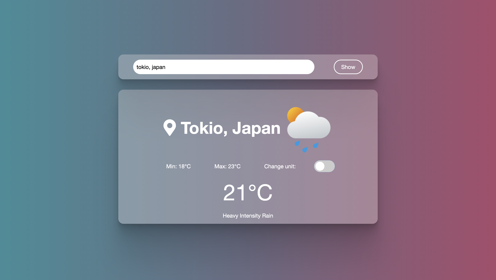

# Weather App

> This project is a basic weather app.

  

The user can request the weather information form a specific city.

Each request will show the min, max and actual temperature. Also the description and icon for the weather, and the name of the requested city.

It is possible to change the units of the temperatures from celcius to farenheight.

If the user try serch for the empty input or a wrong city, the body will display an error message.

The project was made with learning propusses, to practice asynchronous Javascript. There are multiple ways to achive this. In this project, I used a combination of async/await with a try/catch block.

## Live Demo

[Live Demo Link](https://alejandrono4.github.io/todo-list/)

## Getting Started

To get a local copy up and running follow these simple example steps.

- At first, you have to clone this repository. Open your terminal and paste this without the $ sign.

      $ git clone https://github.com/AlejandroNo4/todo-list.git

- Now that you have the repository in your local machine. Change the direction of the local file with your terminal. Just type "$ cd" (without the $ sign) and the path to reach the todo-list folder. 
  Something like:

        $ cd User/Documents/todo-list

- Now to install Webpack, run in your terminal:

        $ npm install webpack webpack-cli --save-dev

- You are done with the installations! Now to run the project, first type:

        $ code .

- This must open Vs code. For now, keep it open. Go back to your terminal and now run: 

        $ npm run build

- Now back on Vs Code, open the "dist" folder. Then right-click on the index.html file and click on open with Live Server.

 

## Built With

- Javascript
- VS Code
- Git
- HTML
- CSS

## Author

👤 **Author1**

- GitHub: [@AlejandroNo4](https://github.com/AlejandroNo4)
- Twitter: [@Alejand80002666](https://twitter.com/Alejand80002666)
- LinkedIn: [Alejandro Contreras Rodriguez](https://www.linkedin.com/in/alejandro-contreras-rodriguez-b524821b5)

## 🤝 Contributing

Contributions, issues, and feature requests are welcome!

Feel free to check the [Issues page](https://github.com/AlejandroNo4/todo-list/issues).

## Show your support

Give a ⭐️ if you like this project!

## Acknowledgments

- Based on the requirements from [The Odin Project](https://www.theodinproject.com/paths/full-stack-javascript/courses/javascript/lessons/todo-list)
- Fonts from [google fonts](https://fonts.google.com/)

## 📝 License

This project is [MIT](./MIT.md) licensed.